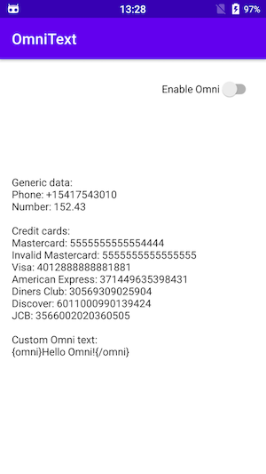
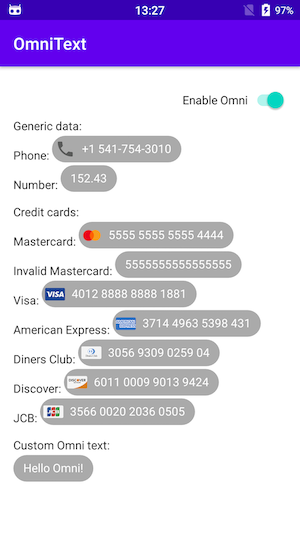

[](https://opensource.org/licenses/Apache-2.0)

# OmniText
Highlights various information (like credit cards, phone numbers, number values) in TextView and adds actions on it.

> Definition of `omni-`: All, Universally

## Example
 

## Installation

```groovy
TBD
```

## Features
There are next `omni` parsers available:
* Custom text wrapped with tag: `{omni}Text Here{/onmi}`
* Numbers: `12.45`, `0.23`, `244532`
* Phone numbers: `+1-234-567-89-00`
* Credit cards (American Express, MasterCard, Visa, etc.): `371449635398431`, `4012 8888 8888 1881`, `6011-0009-9013-9424`
